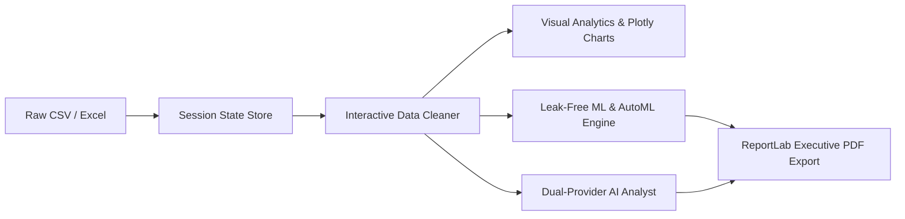

<div align="center">

# AI Data Analyst

### *Next-Generation Autonomous Analytics, Machine Learning & Business Intelligence Platform*

[](https://www.python.org/)
[](https://streamlit.io/)
[](https://scikit-learn.org/)
[](https://docs.pytest.org/)
[](https://github.com/vishalok007/AI_DATA_ANALYST/actions)
[](LICENSE)

---

[Key Features](#key-features) • [System Architecture](#system-architecture) • [Machine Learning Engine](#machine-learning-engine-details) • [Quick Start](#quick-start) • [Automated Testing](#automated-testing)

---

</div>

## Executive Overview

**AI Data Analyst** is an enterprise-grade analytics workspace engineered with **Streamlit**, **Pandas**, **Scikit-Learn**, and **Plotly**. It seamlessly combines automated exploratory data analysis (EDA), interactive data cleaning with session-state persistence, leak-free machine learning pipelines, dual-provider AI interpretation (Groq & Google Gemini), and automated ReportLab PDF executive report generation.



---

## Key Features

<table>
  <tr>
    <td width="50%">
      <h3>Data Profiling & Health Assessment</h3>
      <ul>
        <li><b>Automated Profiling</b>: Instant detection of rows, columns, memory footprint, missingness, and duplicates.</li>
        <li><b>Health Scorecard</b>: Deterministic data quality score derived from completeness and cardinality.</li>
        <li><b>Type Breakdown</b>: Structural column categorization and preview tables.</li>
      </ul>
    </td>
    <td width="50%">
      <h3>Interactive Session-State Cleaner</h3>
      <ul>
        <li><b>Live Transformations</b>: Impute missing values (Mean, Median, Mode, Constant), remove duplicate rows, drop columns, and retype fields.</li>
        <li><b>Cross-Tab Persistence</b>: Cleaned data state updates across all 10 analysis tabs in real time.</li>
        <li><b>One-Click Reset</b>: Revert to original dataset at any time.</li>
      </ul>
    </td>
  </tr>
  <tr>
    <td width="50%">
      <h3>Leak-Free ML & AutoML Workspace</h3>
      <ul>
        <li><b>Model-Tailored Pipelines</b>: <code>OneHotEncoder</code> + <code>StandardScaler</code> for linear models; <code>OrdinalEncoder</code> for tree models.</li>
        <li><b>AutoML Benchmarks</b>: Automated model evaluation ranking by R², MAE, RMSE, Accuracy, and F1 score.</li>
        <li><b>Feature Importance</b>: Direct feature name mapping via Scikit-Learn <code>ColumnTransformer</code>.</li>
      </ul>
    </td>
    <td width="50%">
      <h3>Dual-Provider AI & PDF Reports</h3>
      <ul>
        <li><b>Resilient AI Fallback</b>: Automatic provider failover between <b>Groq</b> and <b>Google Gemini</b> endpoints.</li>
        <li><b>Executive PDF Export</b>: Generates multi-page ReportLab PDF reports containing key statistics, charts, and recommendations.</li>
        <li><b>Smart Recommendations</b>: Automated chart selection based on distribution metrics.</li>
      </ul>
    </td>
  </tr>
</table>

---

## Machine Learning Engine Details

> [!IMPORTANT]
> **Zero Data Leakage Pipeline**
> Preprocessing transformers are fitted exclusively on `X_train` after `train_test_split`. Transformers never inspect the test split during training.

```text
               ┌───────────────────────────────┐
               │       Raw Tabular Data        │
               └───────────────┬───────────────┘
                               │
                      train_test_split()
                               │
               ┌───────────────┴───────────────┐
               ▼                               ▼
       X_train (80%)                    X_test (20%)
               │                               │
    ColumnTransformer.fit()           ColumnTransformer.transform()
   ├─ Numeric: Median + Scaler       ├─ Numeric: Median + Scaler
   └─ Categorical: OneHot/Ordinal    └─ Categorical: OneHot/Ordinal
               │                               │
               ▼                               ▼
        Model.fit()                     Model.predict()
```

---

## System Architecture

```text
AI_DATA_ANALYST/
├── .github/
│   └── workflows/
│       └── ci.yml             # Automated GitHub Actions CI workflow
├── assets/
│   └── styles/
│       └── style.css          # Custom visual styling & theme tokens
├── components/
│   ├── ai_chat.py             # Dual-provider AI assistant workspace
│   ├── charts.py              # Visual analytics renderer
│   ├── column_analyzer.py     # Per-column metric explorer
│   ├── correlation.py         # Correlation matrix dashboard
│   ├── dashboard.py           # Universal dashboard component
│   ├── data_cleaner.py        # Interactive cleaner with live state mutation
│   ├── filters.py              # Global dynamic dataset filters
│   ├── hero.py                # Platform header banner
│   ├── machine_learning.py    # Predictive modeling UI & AutoML report
│   ├── missing_values.py      # Missingness distribution visualizer
│   ├── profile.py             # Structural dataset profile summary
│   ├── quality.py             # Health scorecard component
│   ├── sidebar.py             # Main platform navigation sidebar
│   ├── statistics.py          # Summary statistics table
│   └── universal_charts.py    # Chart recommendation engine
├── tests/
│   ├── test_cleaning.py       # Data cleaning unit tests
│   ├── test_machine_learning.py # ML pipeline & AutoML unit tests
│   ├── test_quality.py        # Data quality score unit tests
│   └── test_statistics.py     # Statistics & correlation unit tests
├── utils/
│   ├── ai_analyst.py          # AI prompt composition & logic
│   ├── ai_provider.py         # Dual API provider manager (Groq / Gemini)
│   ├── automl.py              # AutoML benchmark engine
│   ├── cleaning.py            # Transformation helper functions
│   ├── loader.py              # File loader & session state manager
│   ├── machine_learning.py    # Leak-free Scikit-Learn pipelines
│   ├── pdf_report.py          # ReportLab executive PDF generator
│   ├── profiler.py            # Profiling calculation routines
│   ├── quality.py             # Quality score calculation functions
│   └── statistics.py         # Summary statistics helpers
├── app.py                     # Main Streamlit application entry point
├── README.md                  # Comprehensive project documentation
├── requirements.txt           # Python dependency manifests
└── .gitignore                 # Git version control exclusions
```

---

## Quick Start

### 1. Clone & Navigate
```bash
git clone https://github.com/vishalok007/AI_DATA_ANALYST.git
cd AI_DATA_ANALYST
```

### 2. Environment Setup

**Windows:**
```bash
python -m venv .venv
.venv\Scripts\activate
```

**macOS / Linux:**
```bash
python3 -m venv .venv
source .venv/bin/activate
```

### 3. Install Dependencies
```bash
pip install -r requirements.txt
```

### 4. API Configuration
Create a local `.env` file in the root directory:
```env
AI_PROVIDER=groq
GROQ_API_KEY=your_groq_api_key_here
GEMINI_API_KEY=your_gemini_api_key_here
```

### 5. Launch Platform
```bash
streamlit run app.py
```

---

## Automated Testing

The repository features a complete `pytest` suite validating data cleaning functions, quality metrics, summary statistics, correlation matrices, ML pipelines, and AutoML benchmarks.

```bash
pytest tests/ -v
```

```text
======================== 14 passed in 4.39s ========================
```

---

## Security & Deployment

- **Streamlit Community Cloud**: Connect repository, set `app.py` as entry point, and configure API secrets in Streamlit Secrets.
- **Key Safety**: Never commit `.env` or sensitive API tokens to source control.

---

## License

This project is licensed under the MIT License - see the [LICENSE](LICENSE) file for details.
